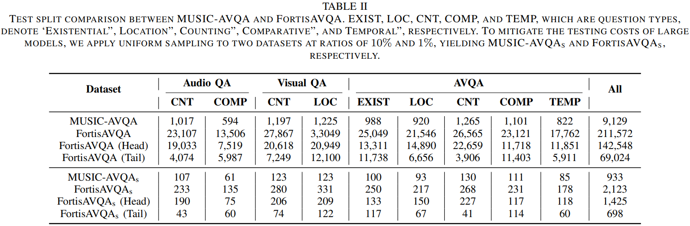
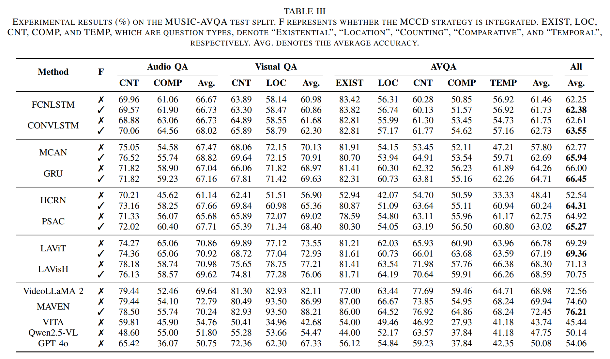
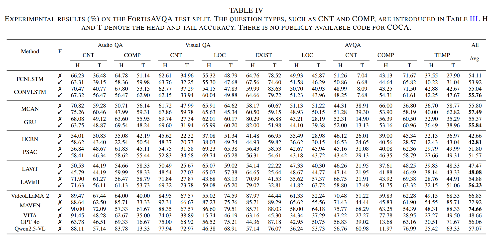

# FortisAVQA and MAVEN: a Benchmark Dataset and Debiasing Framework for Robust Multimodal Reasoning
This repository provides the dataset and implementation for our paper: **"FortisAVQA and MAVEN: a Benchmark Dataset and Debiasing Framework for Robust Multimodal Reasoning"**. This work is an improved and extended version of our [previously published paper](https://github.com/reml-group/MUSIC-AVQA-R) in NeurIPS 2024. *Compared to MUSIC-AVQA-R, we think the head/tail splitting in FortisAVQA is more rational.*


[](https://openreview.net/pdf?id=twpPD9UMUN)
[](https://openreview.net/pdf?id=twpPD9UMUN)


## Overview

Audio-Visual Question Answering (AVQA) is a challenging multimodal reasoning task requiring models to accurately answer natural language queries based on paired audio-video inputs. However, existing AVQA approaches often suffer from overfitting to dataset biases, leading to poor robustness. Moreover, current datasets may not effectively diagnose these methods.

To address these challenges, we introduce:

- **FortisAVQA**, a novel dataset designed for robustness evaluation, constructed in two stages:
  1. Rephrasing test split questions from the MUSIC-AVQA dataset to increase linguistic diversity.
  2. Introducing distribution shifts across question splits to enable a refined robustness evaluation across rare, frequent, and overall question distributions.
- **MAVEN (Multimodal Audio-Visual Epistemic Network)**, a robust generative AVQA model leveraging a multifaceted cycle collaborative debiasing strategy to mitigate bias learning.

## FortisAVQA
We introduce FortisAVQA, the first dataset designed to assess the robustness of AVQA models. Its construction involves two key processes: rephrasing and splitting. Rephrasing modifies questions from the test set of MUSIC-AVQA to enhance linguistic diversity, thereby mitigating the reliance of models on spurious correlations between key question terms and answers. Splitting entails the automatic and reasonable categorization of questions into frequent (head) and rare (tail) subsets, enabling a more comprehensive evaluation of model performance in both in-distribution and out-of-distribution scenarios.

1. You can download the original dataset, including videos and questions in [Videos](https://drive.google.com/drive/folders/1WAryZZE0srLIZG8VHl22uZ3tpbGHtsrQ) and [Questions](). These are provided by the repository of MUSIC-AVQA.
2. Our proposed method, MAVEN, is capable of processing audio, video, and text inputs simultaneously. To facilitate this, we have extracted and separated the audio and video components from the original files. The processed data is available for download [here](). You can also process the original data by using the code located in `./MAVEN/data_tools/extract_audio_multiprocessing.py` .
3. The question annotation in our proposed dataset (FortisAVQA) is shown as follows. You can download the questions [here]().
```json
[
    {
        "video_id": "00000823",
        "question_id": 2945,
        "_comment_question_id": "the id of questions",

        "type": "[\"Audio\", \"Comparative\"]",
        "_comment_type":  "[audio task, question type]",

        "question_content": "Is the clarinet louder than the acoustic_guitar",
        "anser": "yes",
        "_comment_anser": "the answer to questions",

        "split": "tail", 
        "_comment_split": "head or tail split",

        "x": 0.7958979489744872,
        "_comment_x": "k in the Equation (9) of our paper"
    },
    {
        "video_id": "00000823",
        "question_id": 2945,  
        "type": "[\"Audio\", \"Comparative\"]",
        "question_content": "When compared to the acoustic_guitar does the clarinet sound louder?",
        "anser": "yes",
        "split": "tail",
        "x": 0.7958979489744872
    }
]
```
4. The test split of FortisAVQA consists of 211,572 samples. To manage testing costs efficiently, we applied uniform sampling on the MUSIC-AVQA and FortisAVQA to create a representative subset specifically for evaluating large models. You can download the test splits of the mentioned two datasets [here](https://pan.baidu.com/s/1hCGZmf9z3cWy0EA7mb1Hvg) (password: AVQA). The details of this split are shown as follows. .
## Model: MAVEN

MAVEN is a robust AVQA model that incorporates:

- **Multifaceted cycle collaborative debiasing**, which counteracts dataset biases.
- **Plug-and-play compatibility** with baseline models across AVQA datasets.
- **State-of-the-art performance** on FortisAVQA, improving previous results by **9.32%**.

Implementation details are available in the [`MAVEN/`](./MAVEN) directory.

## Installation

### Requirements

Ensure you have Python 3.10 installed and 4+ Tesla A800/100, then install dependencies via:

```bash
pip install -r requirements.txt
```
### Setup

Clone this repository and navigate to the project directory:

```bash
git clone https://github.com/reml-group/fortisavqa.git
cd MAVEN
```

### Traning

Execute the following commands to start the training process:

```bash
export PYTHONPATH=./
export PYTORCH_CUDA_ALLOC_CONF=expandable_segments:True
OUTPUT_DIR=/home/majie/code/MAVEN/
bash script/train/finetuneTask_single_node.sh ${OUTPUT_DIR}
```

You can modify the `MCCD` training configuration [here](./MAVEN/vita/constants.py): 

```python
MCCD = {"flag": True,
        "lambda_multifaceted": 0.001,
        "lambda_cycle": 0.005,
        "multifaceted":{"lang": True, "audio": True, "video": True},
        "cycle": False
        }
```

### Evaluation

```bash
CUDA_VISIBLE_DEVICES=0,1,2,3 python avqa_test.py \
       --model_base	/home/majie/modelhub/VITA_ckpt/ \
       --test_json	/home/majie/gaozhitao/avqa/datahub/FortisAVQA/FortisAVQA-test-1%.json  \
       --output_path /home/majie/code/MAVEN/test_output/output.json \
       --model_path /home/majie/code/MAVEN/llava-s3-finetune_task_lora/checkpoint-3000 \
       --video_dir /home/majie/datahub/FortisAVQA/video \
       --audio_dir /home/majie/datahub/FortisAVQA/audio
```

### Results
- Experimental results(%) on the MUSIC-AVQA test split:

- Experimental results(%) on thr FortisAVQA test split:


### Citation

If you find our dataset or code useful, please cite our work:

```
@article{ma2024look,
  title={Look, Listen, and Answer: Overcoming Biases for Audio-Visual Question Answering},
  author={Ma, Jie and Hu, Min and Wang, Pinghui and Sun, Wangchun and Song, Lingyun and Pei, Hongbin and Liu, Jun and Du, Youtian},
  journal={arXiv preprint arXiv:2404.12020},
  year={2024}
}
```

## License

- **Code**: This project's code is licensed under the [MIT License](LICENSE).
- **Dataset**: The dataset provided in this repository is licensed under the [Creative Commons Attribution 4.0 International (CC BY 4.0)](DATASET_LICENSE).
